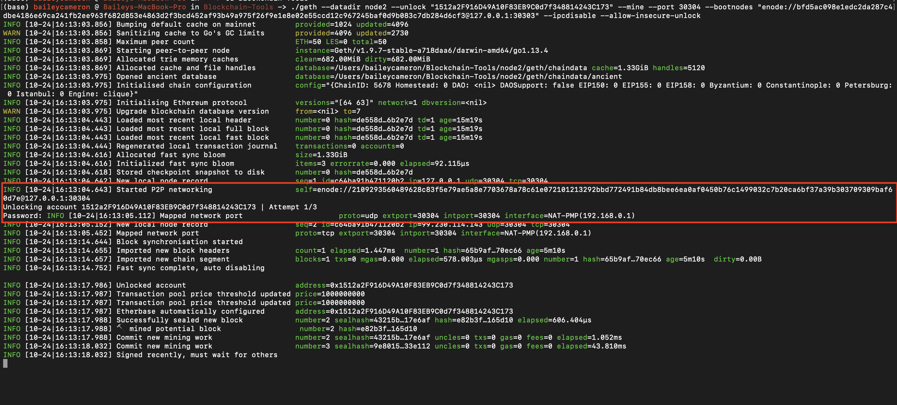

# ZBank - Proof of Authority Development Chain

The following documentation will walk you through activating ZBank's proof of authority development chain in the network 'PupperNetPOA'.

## Installations
Before starting, ensure that you have the following dependencies installed on your company-issued MacOS computer:

* MyCrypto
* Geth

**MyCrypto** is a client-side interface used to generate ether wallets and interact with the development blockchain. For our purposes, MyCrypto will be used to pass test transactions between nodes in the development chain. This tool can be downloaded from the website [https://download.mycrypto.com/](https://download.mycrypto.com/). 

**Geth** (short for Go Ethereum) is an implementation of the Ethereum Protocol. Geth will be used to run the nodes in our PupperNetPOA network. The application can be downloaded from their website [https://geth.ethereum.org/downloads/](https://geth.ethereum.org/downloads/). You will need to download 'Geth & Tools 1.9.7'.

Once Geth is downloaded, you will need to unzip the file `geth-alltools-darwin-amd64-1.9.7-a718daa6.tar.gz` into your home directory and name the resulting folder 'Blockchain-Tools'.

You have now installed all the necessary dependencies to run ZBank's proof of authority development chain. 

---

## Setting up the Genesis Node
Copy the following file and folders from the POA Development Chain folder (this folder) into your newly created 'Blockchain-Tools folder':

* node1/
* node2/
* puppernetpoa.json

The initial genesis block has already been created for you and linked to node 1 and node 2 for you using Puppeth:

We will now use the puppernetpoa.json file to write the genesis block for the blockchain. Open Terminal and initialize the nodes using the following commands: 

`./geth --datadir node1 init puppernetpoa.json`

`./geth --datadir node2 init puppernetpoa.json`

The resulting output should look like the screen capture below.

Now that both nodes are initialized, the nodes can be unsealed using the following commands:

`./geth --datadir node1 --unlock "E172B8a89c5902afaA1444eda37138A5C6708652" --mine --rpc --allow-insecure-unlock`

The above geth command-line options perform the following actions:

|Command-line option   |Description                                                 | 
|:---------------------|:-----------------------------------------------------------|
|--datadir value       |data directory for the databases and keystore               |
|--unlock "PUBLIC KEY" |Public key of the account to unlock (not including the `x0`)| 
|--mine                |enables mining                                              | 
|--rpc                 |Enable the HTTP-RPC server                                  |
|--allow-insecure-unlock|Allow insecure account unlocking when account-related RPCs are exposed by http|

If successful, you should see the following screen:

There are two important pieces of information contained in this screen. The first red box shows your 'enode address', which must be copied in order to start node 2. The second is a small password prompt, where you must enter the password provided to you by your IT professional. ;)

Now node 1 will be up and running. In order to start node 2, enter the following code into a new Terminal window:

`./geth --datadir node2 --unlock "1512a2F916D49A10F83EB9C0d7f348814243C173" --mine --port 30304 --bootnodes "enode://SEALER_ONE_ENODE_ADDRESS@127.0.0.1:30303" --ipcdisable --allow-insecure-unlock`

The above geth command-line options perform the following actions:

|Command-line option   |Description                                                 | 
|:---------------------|:-----------------------------------------------------------|
|--port                |Network listening port (default: 30303)                     |
|--bootnodes           |Comma separated enode URLs for P2P discovery bootstrap      |
|--ipcdisable          |Disable the IPC-RPC server                                  |

If successful, the following screen should appear:

Again, you will need to enter the password for node 2 provided to you by your IT professional.

Both nodes should now be up and running and communicating.

----

## Sending a Test Transaction 

Open the MyCrypto application and connect to the new PupperNetPOA network. You can change the network by clicking on the 'Change Network' button in the bottom corner.

Scroll to the bottom of the pop-up tool bar and select '+ add custom node'. You will then need to enter the following in the pop-up:

Once finished, click 'Save & Use Custom Node' to connect to the actively running nodes. 

We can now access the wallet for node 1 and send a test transaction to node 2 to ensure the two nodes are communicating. Return to the home page of MyCrypto unlock your wallet using the Keystore file:

Open the keystore for node 1. It will be located in `~/Blockchain-Tools/node1/keystore/`. You will then need to use the password provided by your IT professional to unlock the wallet.

Once you have uploaded the keystore and entered your password, you will need to send a test transaction between the two nodes. Enter the public key of the second node `0x1512a2F916D49A10F83EB9C0d7f348814243C173` into the 'To Address' field and enter an arbitrary amount to send:

Press 'Send Transaction' and you should get the resulting pop-up screen asking you to confirm the transaction:

Once the transaction is confirmed, you can check on the transactions status by pressing on the green banner that pops up.

As we can see here, the transaction was successful

---

## Resources
* https://geth.ethereum.org/docs/interface/command-line-options
